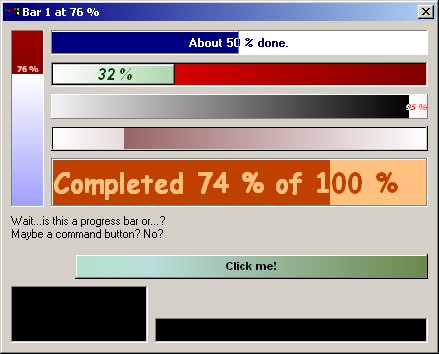



## Minun Progress Bar 1\.8

### Description

This is the coolest Progress Bar control you have seen out there. Includes many nice features. Can do colorfading, text scrolling, borderstyles, can be set vertical...anything you can think of. Besides that, the code is very efficient and fast. A good example on how an ActiveX / OCX is made and what it needs.
 
### More Info
 
The zip doesn't include any sample programs, only the control sources. Code is not commented.

             |
---                |---
**Submitted On**   |2002-11-14 17:08:56
**By**             |[Vesa Piittinen](https://github.com/Planet-Source-Code/PSCIndex/blob/master/ByAuthor/vesa-piittinen.md)
**Level**          |Advanced
**User Rating**    |5.0 (65 globes from 13 users)
**Compatibility**  |VB 5\.0, VB 6\.0
**Category**       |[Custom Controls/ Forms/  Menus](https://github.com/Planet-Source-Code/PSCIndex/blob/master/ByCategory/custom-controls-forms-menus__1-4.md)
**World**          |[Visual Basic](https://github.com/Planet-Source-Code/PSCIndex/blob/master/ByWorld/visual-basic.md)
**Archive File**   |[Minun\_Prog1507141232002\.zip](https://github.com/Planet-Source-Code/vesa-piittinen-minun-progress-bar-1-8__1-41267/archive/master.zip)

